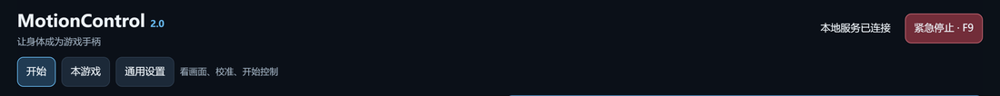
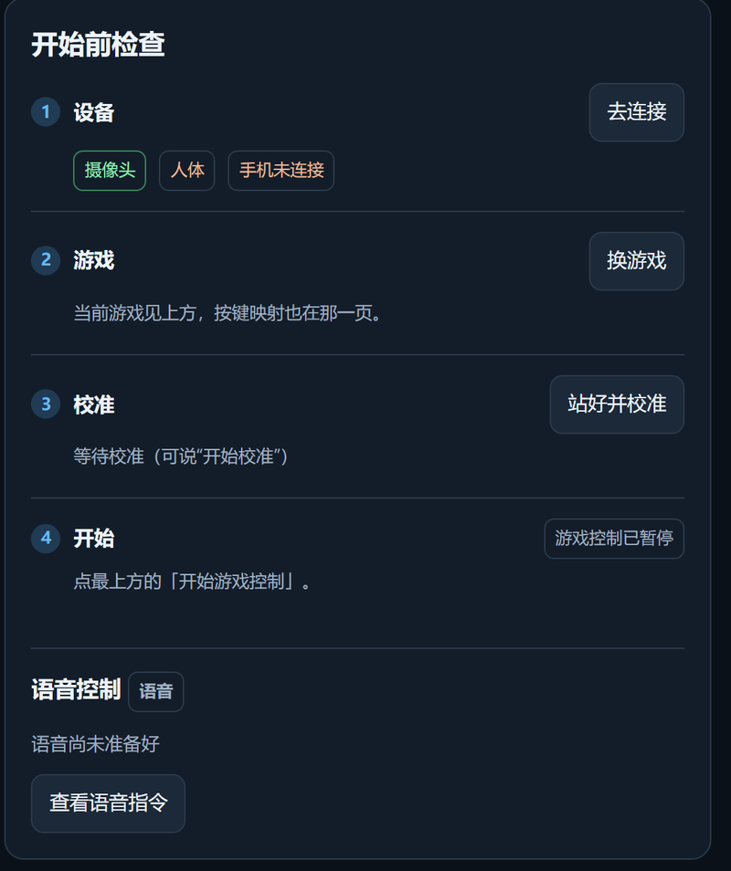
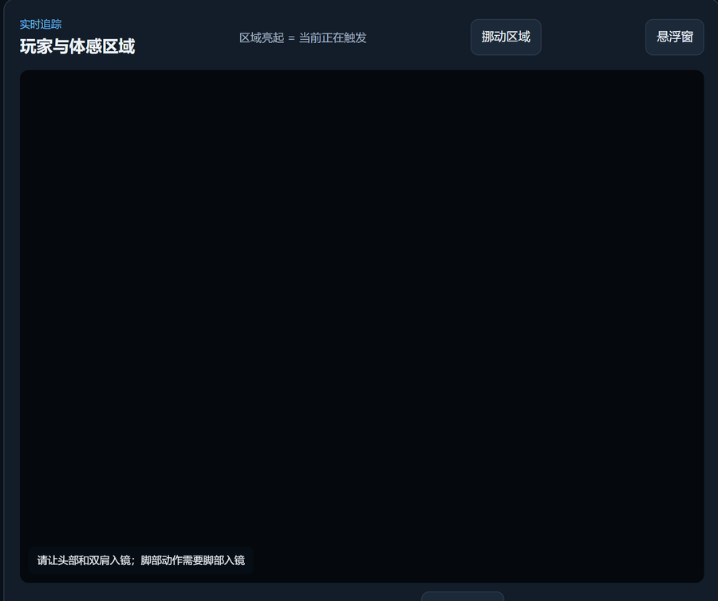
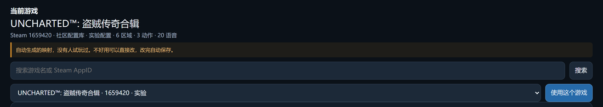
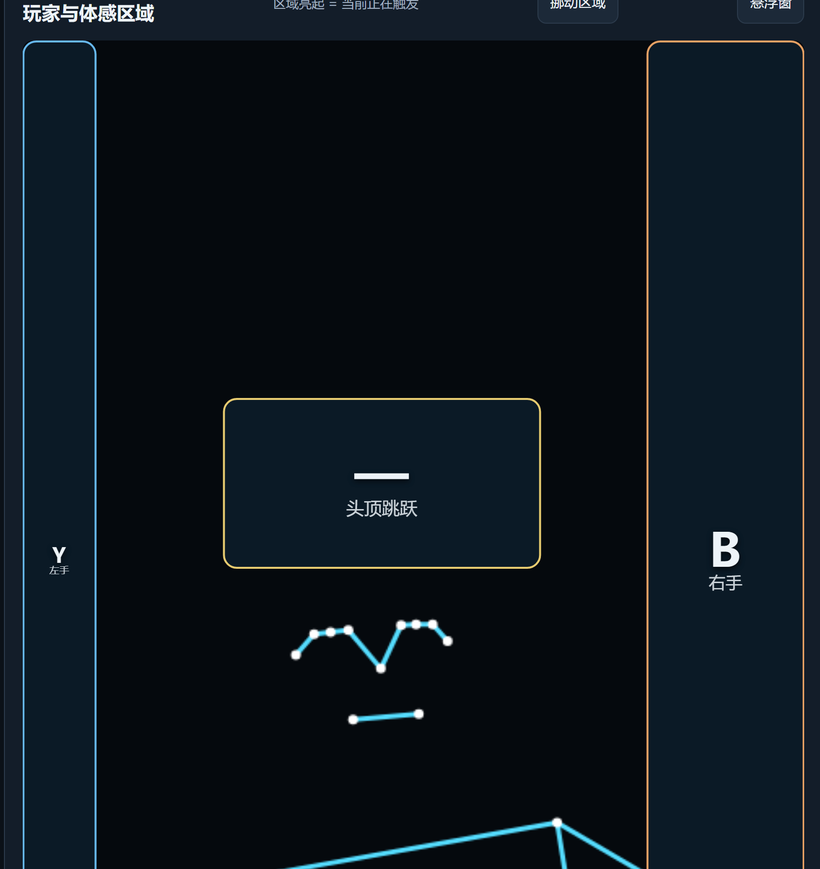
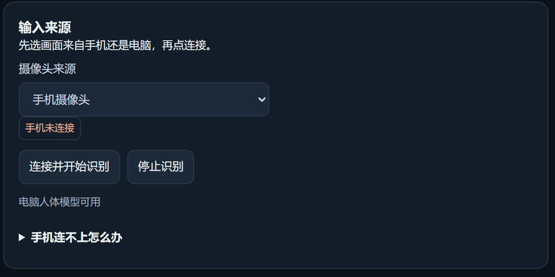

# 新手指南

从下载到能玩，大约十分钟。这里只讲第一次要做的事。

---

## 你需要

| | 说明 |
|---|---|
| **Windows 电脑** | 虚拟手柄驱动只有 Windows 版 |
| **一个摄像头** | 笔记本自带的就行 |
| **两米见方的空地** | 这是站着玩的，坐着不行 |

Android 手机是可选的，只在笔记本摄像头拍不全你的身体时才需要。

---

## 第一步　装驱动

双击 **`安装虚拟手柄驱动.exe`**，装完可能要重启。每台电脑只装一次。

**不能跳过。** 不装的话，你做动作时界面上区域会亮，但游戏里没有任何反应。

> 驱动是开源的 [ViGEmBus](https://github.com/nefarius/ViGEmBus/releases)，作用是模拟出一个 Xbox 手柄。包里带的是官方原版。

---

## 第二步　启动

双击 **`启动.bat`**。弹出的黑框**不要关**，它就是软件本身。

浏览器会自动打开 `http://127.0.0.1:8766`。没自动开就手动粘贴这个地址。



| 标签页 | 放什么 |
|---|---|
| **开始** | 看画面、校准、开始控制。第一次主要用这页 |
| **本游戏** | 只影响当前游戏的按键映射 |
| **通用设置** | 所有游戏共用：设备、手感、语音 |

---

## 第三步　跟着「开始前检查」走

右边这个清单会告诉你卡在哪一步，每一步都有按钮直接跳过去。



### 1　设备

- **摄像头** 绿色 = 找到摄像头
- **人体** 绿色 = **现在正看见你**；灰色说明画面里没人或拍不全
- **手机未连接** 不用手机就不用管

「人体」是灰的时候，左边画面会提示：



站到摄像头前，让**头和两个肩膀**都进画面。要用踏步、抬腿这类动作的话，脚也得拍得到——通常意味着退后到两米外，或把摄像头架高。

### 2　游戏

点「换游戏」搜你要玩的那个。



内置约 200 个配置，但**绝大多数是自动生成的，没有人真的玩过**，界面上标着「实验配置」。不好用是正常的，在「本游戏」页可以自己改，改完自动保存。标「已验证」的才实际跑通过。

搜不到你的游戏就随便选一个再自己改。

### 3　校准

点「站好并校准」，或者直接说 **"开始校准"**。

它记住你此刻的位置和朝向当作"正前方"，之后的动作都相对这个基准算。校准时**站好、看向屏幕中心、别乱动**。

### 4　开始

点最上方蓝色的「**开始游戏控制**」。从这一刻起你的动作变成手柄输入，切到游戏就能玩。

> **随时按 `F9` 紧急停止。** 识别抽风、鼠标乱飞时，这个键立刻切断所有输出。

---

## 画面里的框是什么



| 框 | 位置 | 触发方式 |
|---|---|---|
| **Y** | 左手边 | 左手伸进去 |
| **B** | 右手边 | 右手伸进去 |
| **头顶跳跃** | 头顶 | 手举过头顶 |
| **LB / RB** | 左右脚边 | 抬脚踩进去 |

**框亮 = 这个键正被按下。** 这是判断"它到底认没认出来"最直接的办法：先看框亮不亮，再去游戏里看反应。

框跟着你的身体走，在房间里走动不用重新对位。按键绑成什么在「本游戏」页改。

---

## 手机当摄像头（可选）

笔记本摄像头拍不全身体时用。装上 APK，和电脑连**同一个网络**，在「通用设置 → 输入来源」把来源改成「手机摄像头」。



首次要配对：网页上点「配对新设备」拿到 8 位码，在手机上填进去，2 分钟内有效。之后电脑会记住这台手机。

插数据线也能连，不需要打开 USB 调试。

手机端**本地识别**，只把关键点坐标发给电脑，**画面不出手机**。

---

## 出问题了

### 动作认出来了，游戏里没反应

八成是**驱动没装**。做动作时看框亮不亮：亮了说明识别没问题，问题在输出。

也可能是游戏本身要在设置里手动切到手柄模式。

### 「人体」一直是灰的

退后一点让头和双肩入镜；别逆光；太暗就开灯。

### 手机连不上

- 确认手机和电脑**在同一个 WiFi**
- 「通用设置」里展开「手机连不上怎么办」，里面列着所有可用地址
- Windows 防火墙第一次会弹窗，**要点允许**。当时点了拒绝的话，手机会一直连不上而且界面看不出原因——去防火墙设置里删掉 Python 的规则，重启程序再试

### 鼠标乱飞 / 视角一直转

按 **F9**，然后在「通用设置 → 手感」调灵敏度和中心死区。

### 那个绿色的「上下视角」框是干嘛的

用手控鼠标转视角的话用不着它。「通用设置 → 视角 → 上下视角控制」选「关闭」，框就不出现了。

---

## 设置存在哪

```
%LOCALAPPDATA%\MotionControl\
```

复制这一行粘到文件管理器地址栏就能打开。按键映射、自定义动作、语音口令、校准数据都在这里，**不在程序文件夹里**。

所以程序文件夹可以随便挪、随便改名；但拷到另一台电脑，设置**不会**跟着走。换电脑、换摄像头、或摄像头挪了位置，都要重新校准。

---

## 还有问题

到 [GitHub](https://github.com/guiwushengzhe-prog/MotionControl) 开 issue。

调好了某个游戏的映射欢迎分享——那两百个自动生成的配置真的需要有人去试。
